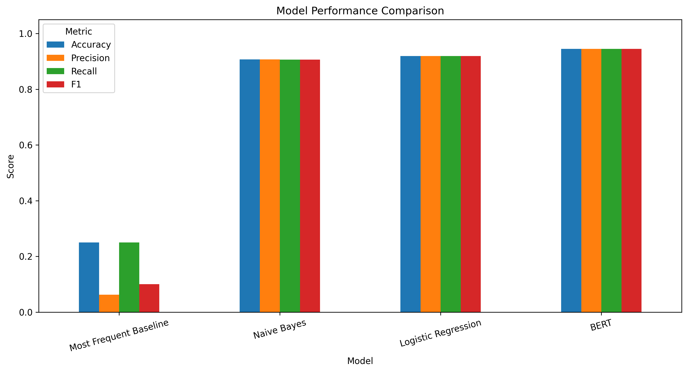
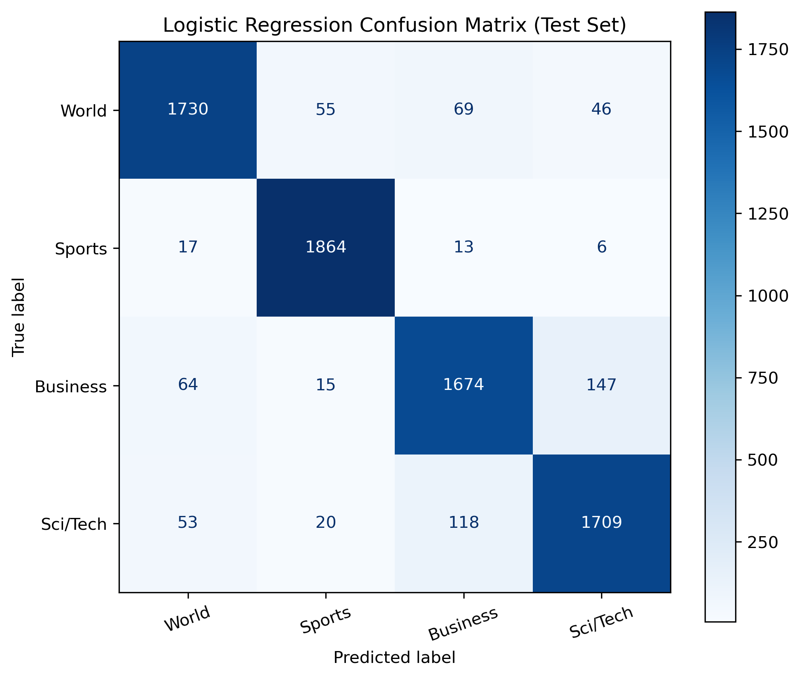
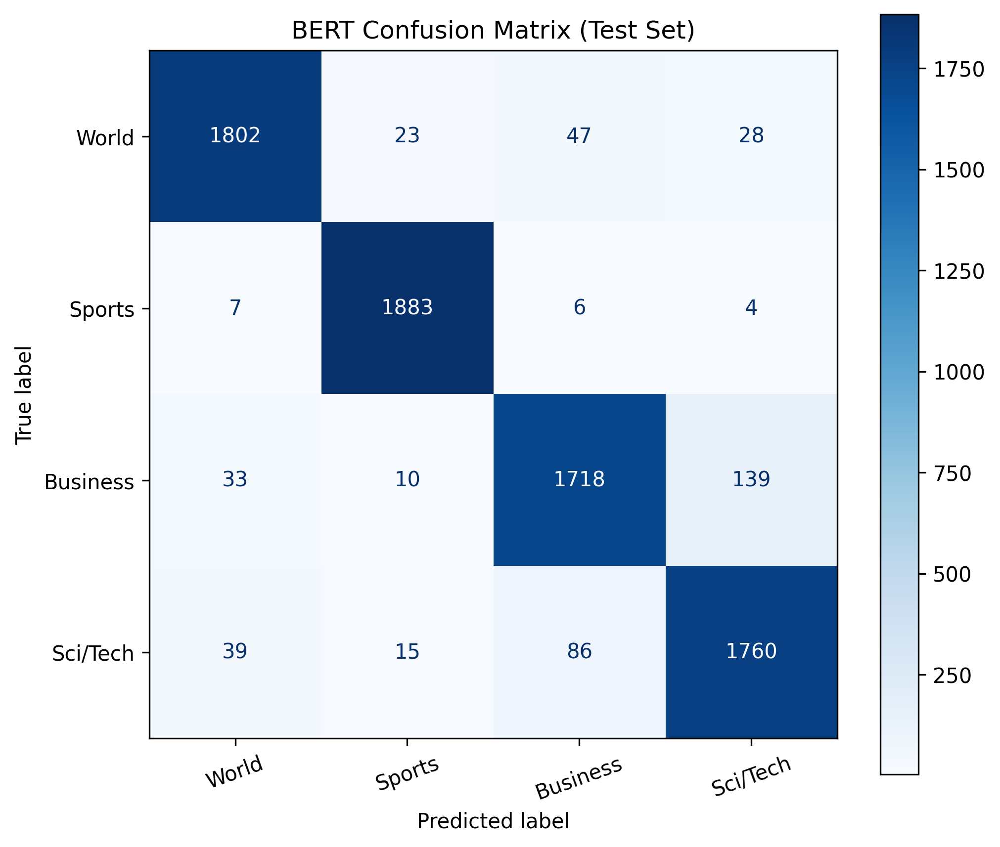

# News Topic Classification Using Machine Learning and BERT


This project compares traditional TF-IDF-based machine learning models with a fine-tuned BERT model on the AG News dataset.

The main goal was not only to measure whether BERT performs better, but also to understand where that improvement appears. In particular, we wanted to see whether BERT helps most on news examples where the topic is not obvious from keywords alone.

---

## Team Members

- George Liu
- Gordon Zau
- Louis Dong
- Zhiqi Zhou

---

## Research Question

**How much does a transformer-based model like BERT improve news topic classification compared with traditional TF-IDF-based classifiers?**

---

## Dataset

We used the **AG News Dataset**, a common benchmark dataset for text classification. Each example is a short news headline or description labeled as one of four topics.

| Label ID | Category |
| -------- | -------- |
| 0        | World    |
| 1        | Sports   |
| 2        | Business |
| 3        | Sci/Tech |

### Dataset Split

| Split      |    Size |
| ---------- | ------: |
| Training   | 108,000 |
| Validation |  12,000 |
| Test       |   7,600 |

---

## Methods

We compared three traditional models with one transformer-based model.

### Data Split Procedure

The original AG News training set contains 120,000 examples. We split it into 108,000 training examples and 12,000 validation examples with `datasets.train_test_split(test_size=0.1, seed=42, stratify_by_column="label")`, which kept the class distribution balanced across the split.

The validation set was used for model selection and hyperparameter tuning. The official 7,600-example AG News test set was kept separate during development and used only for the final evaluation.

### Traditional Machine Learning Models

For the traditional models, text was converted into **TF-IDF unigram and bigram features**. These features were used to train:

- Most Frequent Baseline
- Multinomial Naive Bayes
- Logistic Regression

The most frequent baseline gives a simple lower-bound comparison, while Naive Bayes and Logistic Regression are common starting points for text classification.

### BERT Model

We fine-tuned `bert-base-uncased` for four-class classification. BERT represents tokens based on surrounding context, which can help when news topics overlap or when individual keywords are misleading.

Due to time and compute limits, we trained one BERT configuration rather than running a large hyperparameter search.

---

## Models Compared

| Category     | Model                      |
| ------------ | -------------------------- |
| Baseline     | Most Frequent              |
| Classical ML | Multinomial Naive Bayes    |
| Classical ML | Logistic Regression        |
| Transformer  | BERT (`bert-base-uncased`) |

---

## Results

All scores below were evaluated on the held-out AG News test set.

| Model                  | Accuracy | Precision | Recall | F1 Score |
| ---------------------- | -------: | --------: | -----: | -------: |
| Most Frequent Baseline |   0.2500 |    0.0625 | 0.2500 |   0.1000 |
| Naive Bayes            |   0.9024 |    0.9019 | 0.9024 |   0.9019 |
| Logistic Regression    |   0.9180 |    0.9178 | 0.9180 |   0.9178 |
| **BERT**               | **0.9425** | **0.9424** | **0.9425** | **0.9424** |

BERT achieved the highest score across all metrics. At the same time, Logistic Regression was a strong baseline, reaching over 91% accuracy with a simpler and cheaper model.

---

## Visualizations

### Overall Model Comparison



### Logistic Regression Confusion Matrix



### BERT Confusion Matrix



---

## Error Analysis: BERT vs. Logistic Regression

To understand the difference between Logistic Regression and BERT more directly, we compared their predictions on the same 7,600 test examples.

| Case                                     | Count | Share of Test Set |
| ---------------------------------------- | ----: | ----------------: |
| Both correct                             | 6,862 |             90.3% |
| Logistic Regression wrong / BERT correct |   301 |              4.0% |
| BERT wrong / Logistic Regression correct |   115 |              1.5% |
| Both wrong                               |   322 |              4.2% |

BERT corrected 301 examples that Logistic Regression missed, while Logistic Regression corrected 115 examples that BERT missed. That gives BERT a net gain of 186 examples, which accounts for most of the accuracy gap between the two models.

### Where BERT Helped

Many of BERT's gains came from examples where two categories shared similar vocabulary.

| Logistic Regression Error Type | Count |
| ------------------------------ | ----: |
| Sci/Tech -> Business           |    56 |
| Business -> Sci/Tech           |    44 |
| Business -> World              |    40 |
| World -> Sports                |    38 |
| World -> Business              |    31 |
| World -> Sci/Tech              |    25 |

Examples where Logistic Regression was wrong and BERT was correct:

- **`IBM to hire even more new workers. By the end of the year, the computing giant plans to have its biggest headcount since 1991.`** True label: *Sci/Tech*. Logistic Regression predicted *Business*, likely reacting to words like "hire," "workers," and "headcount." BERT predicted *Sci/Tech*.
- **`Justices to debate mail-order wine...`** True label: *Business*. Logistic Regression predicted *Sci/Tech*, while BERT predicted *Business*.
- **`Live: Olympics day four. Richard Faulds and Stephen Parry are going for gold for Great Britain in Athens.`** True label: *World*. Logistic Regression predicted *Sports*, while BERT predicted *World*.
- **`India's Tata expands regional footprint via NatSteel buyout.`** True label: *World*. Logistic Regression predicted *Business*, while BERT predicted *World*.

These examples suggest that Logistic Regression sometimes relied too heavily on individual keywords, while BERT was better able to use the surrounding context. This is the same basic idea behind separating "Apple" as a company from "apple" as a fruit: the surrounding words change what the token means. This does not make BERT perfect, but it does explain why it helped most on examples with overlapping topic vocabulary.

### Where BERT Still Struggled

BERT still made errors, especially in categories that naturally overlap.

| Both-Wrong Confusion Pair | Count |
| ------------------------- | ----: |
| Business <-> Sci/Tech     |   164 |
| World <-> Business        |    62 |
| Sci/Tech <-> World        |    57 |

Some AG News categories are genuinely difficult to separate because real news stories often combine technology, business, and world events. For example, a story about a technology company can also be written from a business perspective.

### Headline Length Check

We also checked whether BERT's improvement was mainly related to headline length. The median word count was about 36 for the full test set, BERT-correct examples, BERT-error examples, and Logistic Regression-wrong/BERT-right examples.

That suggests BERT's improvement was not mainly due to longer or shorter examples. It was more likely related to how the models handled overlapping topic vocabulary.

---

## Main Takeaways

- Logistic Regression was a strong traditional baseline for this task.
- BERT achieved the best overall performance.
- BERT's largest gains came from examples where topic labels had overlapping vocabulary.
- The performance gap was meaningful, but not huge, because TF-IDF-based models already performed well on AG News.
- Compute cost matters: BERT performed better, but it was slower and more expensive to train than the traditional models.

---

## Limitations

- **Single training run:** We report results from one run and did not evaluate variance across multiple random seeds.
- **Limited hyperparameter tuning:** We did not run a large search over BERT settings due to compute and time limits.
- **Clean benchmark dataset:** AG News is balanced and relatively clean, which may not reflect messier real-world news data.
- **Same-distribution evaluation:** The train and test examples come from the same dataset distribution. We did not test on articles from a different source or time period.
- **Short text inputs:** The examples are short headlines or descriptions, so the results may not transfer directly to full-length articles.
- **No calibration analysis:** We evaluated accuracy, precision, recall, and F1, but did not analyze probability calibration.

---

## Future Work

Possible extensions include:

- Compare BERT with DistilBERT, RoBERTa, or other transformer models
- Run experiments with multiple random seeds
- Evaluate the models on a different news dataset to test domain shift
- Analyze model confidence and calibration
- Build a simple demo for classifying new headlines

---

## Project Structure

```text
News-Topic-Classification/
│
├── data/
│   └── README.md
│
├── src/
│   ├── baseline_models.py
│   ├── bert_model.py
│   ├── error_analysis.py
│   ├── overlap_analysis.py
│   ├── plot.py
│   └── utils.py
│
├── results/
│   ├── csv/
│   └── plots/
│
├── writeup/
│   └── final_paper.tex
│         
│
├── presentation/
│   └── presentation.pdf   
│ 
│
├── requirements.txt
├── LICENSE
└── README.md
```

---

## Installation

### Clone the Repository

```bash
git clone https://github.com/kechavious/News-Topic-Classification-Using-Machine-Learning-and-Transformer-Based-Models.git
cd News-Topic-Classification-Using-Machine-Learning-and-Transformer-Based-Models
```

### Create a Virtual Environment

```bash
python -m venv venv
```

### Activate the Environment

Windows:

```bash
venv\Scripts\activate
```

macOS/Linux:

```bash
source venv/bin/activate
```

### Install Dependencies

```bash
pip install -r requirements.txt
```

---

## Running the Project

Train the traditional baseline models:

```bash
python src/baseline_models.py
```

Train the BERT model:

```bash
python src/bert_model.py
```

Run the overlap/error analysis:

```bash
python src/overlap_analysis.py
```

Generate visualizations:

```bash
python src/plot.py
```

---

## BERT Training Configuration

| Parameter     | Value               |
| ------------- | ------------------- |
| Base Model    | `bert-base-uncased` |
| Epochs        | 2                   |
| Batch Size    | 8                   |
| Learning Rate | 2e-5                |
| Optimizer     | AdamW               |
| Max Length    | 128                 |

---

## Technologies Used

- Python
- Pandas
- NumPy
- Scikit-learn
- PyTorch
- Hugging Face Transformers
- Matplotlib

---

## Reproducibility Notes

This repository includes the training scripts, evaluation outputs, plots, and analysis scripts used for the project.

Trained BERT checkpoints are not included because of file size limits.

Dependency versions are listed in `requirements.txt`. The training scripts also write experiment configuration files into `results/csv/`, including dataset split information, hyperparameters, and package versions.

To reproduce the BERT result locally, run:

```bash
python src/bert_model.py
```

---

## References

### Foundational Models & Architectures

- **[1]** Vaswani, A., et al. (2017). *Attention Is All You Need.* NeurIPS.  
  📄 [arXiv:1706.03762](https://arxiv.org/abs/1706.03762)

- **[2]** Devlin, J., Chang, M.-W., Lee, K., & Toutanova, K. (2019). *BERT: Pre-training of Deep Bidirectional Transformers for Language Understanding.* NAACL-HLT.  
  📄 [aclanthology.org/N19-1423](https://aclanthology.org/N19-1423/)

- **[3]** Kim, Y. (2014). *Convolutional Neural Networks for Sentence Classification.* EMNLP.  
  📄 [aclanthology.org/D14-1181](https://aclanthology.org/D14-1181/)

- **[4]** Yang, Z., Yang, D., Dyer, C., He, X., Smola, A., & Hovy, E. (2016). *Hierarchical Attention Networks for Document Classification.* NAACL-HLT.  
  📄 [aclanthology.org/N16-1174](https://aclanthology.org/N16-1174/)

### Classical Text Classification

- **[5]** McCallum, A., & Nigam, K. (1998). *A Comparison of Event Models for Naive Bayes Text Classification.* AAAI Workshop on Learning for Text Categorization.

- **[6]** Salton, G., & Buckley, C. (1988). *Term-Weighting Approaches in Automatic Text Retrieval.* Information Processing & Management, 24(5), 513–523.

- **[7]** Joulin, A., Grave, E., Bojanowski, P., & Mikolov, T. (2017). *Bag of Tricks for Efficient Text Classification.* EACL.  
  📄 [aclanthology.org/E17-2068](https://aclanthology.org/E17-2068/)

### Datasets & Benchmarks

- **[8]** Zhang, X., Zhao, J., & LeCun, Y. (2015). *Character-Level Convolutional Networks for Text Classification* (AG News dataset). NeurIPS.  
  📄 [arXiv:1509.01626](https://arxiv.org/abs/1509.01626)

### Analysis & Optimization

- **[9]** Tenney, I., Das, D., & Pavlick, E. (2019). *BERT Rediscovers the Classical NLP Pipeline.* ACL.  
  📄 [aclanthology.org/P19-1452](https://aclanthology.org/P19-1452/)

- **[10]** Loshchilov, I., & Hutter, F. (2019). *Decoupled Weight Decay Regularization* (AdamW). ICLR.  
  📄 [arXiv:1711.05101](https://arxiv.org/abs/1711.05101)

### Software & Libraries

- **[11]** Wolf, T., et al. (2020). *Transformers: State-of-the-Art Natural Language Processing.* EMNLP System Demonstrations.  
  📄 [aclanthology.org/2020.emnlp-demos.6](https://aclanthology.org/2020.emnlp-demos.6/)

- **[12]** Pedregosa, F., et al. (2011). *Scikit-learn: Machine Learning in Python.* JMLR, 12, 2825–2830.  
  📄 [jmlr.org/papers/v12/pedregosa11a](https://jmlr.org/papers/v12/pedregosa11a.html)

---

## License

This project is released under the MIT License. See `LICENSE` for details.

---

## Maintainer

**Gordon Zau**

GitHub: [https://github.com/kechavious](https://github.com/kechavious)
